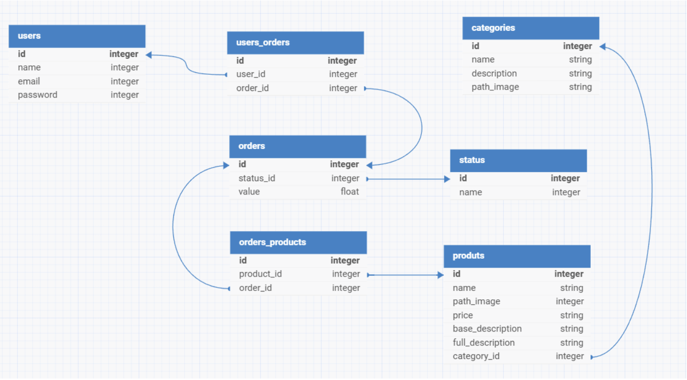

# Burger Mania **(Back-end)**

## 💻 Projeto

Desenvolvimento do **back-end** de uma aplicação web de uma Hamburgueria (Burguer Mania) utilizando os frameworks .NET e o Entity Framework, seguindo o modelo de dados que pode ser visualizado [nessa imagem](./Modelo-do-banco-de-dados.png).
  
A implementação da API segue o padrão REST e se conecta ao **front-end** que se encontra neste outro
<a href="https://github.com/luiscarloscamara/hamburgueria-front" target="_blank" rel="noopener noreferrer">repositório GitHub</a>.
  

  <a href="#-projeto">Projeto</a>&nbsp;&nbsp;&nbsp;|&nbsp;&nbsp;&nbsp;
  <a href="#-executar">Executar</a>&nbsp;&nbsp;&nbsp;|&nbsp;&nbsp;&nbsp;
  <a href="#-tecnologias">Tecnologias</a>&nbsp;&nbsp;&nbsp;|&nbsp;&nbsp;&nbsp;
  <a href="#-licença">Licença</a>

  

## ⏳ Executar Projeto

1. Clonar o repositório
2. Abrir em uma IDE
3. Executar o comando `dotnet restore`
4. Executar o comando `dotnet ef database update`
5. Executar o comando `dotnet run`
6. Executar o comando `start http://localhost:5290/swagger` ***em outro terminal***
7. A aplicação será executada em uma janela do seu navegador padrão

**Obs.:** Ao executar o comando `dotnet ef database update`, o banco de dados será criado e populado automaticamente com dados iniciais nas tabelas, conforme especificado na classe [SeedData](./Models/SeedData.cs) e no [AppDbContext](./Context/AppDbContext.cs). Essa classe define registros pré-configurados para as entidades `Status`, `Users`, `Categories` e `Products`, garantindo que o banco de dados já esteja preenchido. Por exemplo, os status "Pendente", "Em Processamento" e "Finalizado", além de categorias e produtos detalhados com suas descrições e imagens, serão inseridos no banco durante a migração. Isso facilita a inicialização do sistema com dados prontos para testes e uso imediato. 

## 🚀 Tecnologias utilizadas

- .NET;
- Entity Framework;
- PostgreSQL;
- Swagger.

## 📝 Licença

Esse projeto está sob a licença MIT.  
